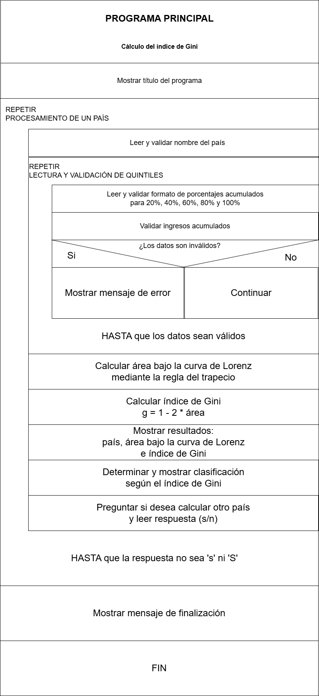

# Proyecto 1 - Índice de Gini

Curso: IC-8052 Lenguajes de Programación  
Tema: Programación Procedimental  

## Descripción

Este programa calcula el coeficiente de Gini de un país a partir de los datos acumulados de distribución del ingreso por quintiles.

El cálculo se realiza utilizando la fórmula:

```txt
g = 1 - 2 * área bajo la curva de Lorenz
```

El área bajo la curva de Lorenz se aproxima mediante la regla del trapecio.

## Lenguaje utilizado

El proyecto fue desarrollado en lenguaje C, siguiendo un enfoque de programación procedimental y estructurada.

## Estructura del proyecto

```txt
Proyecto1-LDP/
├── main.c
├── entrada.c
├── entrada.h
├── validacion_entrada.c
├── validacion_entrada.h
├── gini.c
├── gini.h
├── clasificacion.c
├── clasificacion.h
├── constantes.h
├── README.md
└── Diagrama_Nassi_Gini.png
```

## Descripción de archivos

* `main.c`: controla el flujo principal del programa.
* `entrada.c` / `entrada.h`: contiene las funciones encargadas de solicitar datos al usuario, como el nombre del país, los porcentajes acumulados del ingreso y la respuesta para continuar o finalizar.
* `validacion_entrada.c` / `validacion_entrada.h`: contiene funciones auxiliares para limpiar líneas de entrada, validar texto y leer números de forma segura, evitando ciclos por entradas no numéricas.
* `gini.c` / `gini.h`: contiene las funciones de validación matemática de los datos acumulados, el cálculo del área bajo la curva de Lorenz y el cálculo del índice de Gini.
* `clasificacion.c` / `clasificacion.h`: contiene la clasificación del país según el valor del índice de Gini.
* `constantes.h`: contiene constantes generales del programa, como la cantidad de puntos de la curva y la longitud máxima del nombre del país.

## Diagramas de flujo

El programa incluye un diagrama Nassi-Schneiderman para visualizar el flujo de control:



## Compilación

Para compilar el programa, ubicarse en la carpeta `Solutions/C` y ejecutar:

```bash
gcc main.c entrada.c validacion_entrada.c gini.c clasificacion.c -o gini
```

En Windows, puede generarse el ejecutable con extensión `.exe`:

```powershell
gcc main.c entrada.c validacion_entrada.c gini.c clasificacion.c -o gini.exe
```

También se recomienda compilar con advertencias activadas:

```bash
gcc -Wall -Wextra main.c entrada.c validacion_entrada.c gini.c clasificacion.c -o gini
```

En Windows:

```powershell
gcc -Wall -Wextra main.c entrada.c validacion_entrada.c gini.c clasificacion.c -o gini.exe
```

## Ejecución

En Windows PowerShell:

```powershell
.\gini.exe
```

En Linux, macOS o terminales tipo Unix:

```bash
./gini
```

Si se utiliza un IDE o editor diferente, se deben agregar al proyecto todos los archivos fuente:

```txt
main.c
entrada.c
validacion_entrada.c
gini.c
clasificacion.c
```

Además, deben estar disponibles los archivos de encabezado:

```txt
constantes.h
entrada.h
validacion_entrada.h
gini.h
clasificacion.h
```

Es importante que el entorno de desarrollo compile todos los archivos `.c` juntos, no solamente `main.c`, porque el programa está dividido en módulos.

## Datos solicitados al usuario

El programa solicita:

1. Nombre del país.
2. Porcentaje acumulado del ingreso para el 20% de la población.
3. Porcentaje acumulado del ingreso para el 40% de la población.
4. Porcentaje acumulado del ingreso para el 60% de la población.
5. Porcentaje acumulado del ingreso para el 80% de la población.
6. Porcentaje acumulado del ingreso para el 100% de la población.

Los valores deben ingresarse como porcentajes. Por ejemplo, para 3.1%, se debe digitar:

```txt
3.1
```

Internamente, el programa convierte ese valor a decimal dividiéndolo entre 100.

## Ejemplo de prueba

Datos para Estados Unidos:

```txt
Nombre del país: Estados Unidos
20%: 3.1
40%: 11.3
60%: 25.2
80%: 47.8
100%: 100
```

Resultado esperado:

```txt
Área bajo la curva de Lorenz: 0.2748
Índice de Gini: 0.4504
Clasificación: Mala distribución del ingreso.
```

## Clasificación utilizada

```txt
g < 0.30              Muy buena distribución del ingreso
0.30 <= g < 0.35     Buena distribución del ingreso
0.35 <= g < 0.40     Distribución regular del ingreso
0.40 <= g < 0.45     Distribución desigual del ingreso
0.45 <= g <= 0.50    Mala distribución del ingreso
g > 0.50             Enorme desigualdad del ingreso
```

## Validaciones realizadas

El programa valida que:

- Los valores ingresados estén entre 0 y 100.
- Los porcentajes acumulados no disminuyan.
- El último valor acumulado sea 100%.
- El primer punto de la curva sea 0%, agregado automáticamente por el programa.

## Criterio de finalización

Después de calcular el índice de Gini de un país, el programa pregunta si el usuario desea calcular otro país.

```txt
Desea calcular otro pais? (s/n):
```

Si el usuario responde `s` o `S`, el programa continúa.  
Con cualquier otra respuesta, el programa finaliza.

## Prueba adicional

Para una distribución perfectamente igualitaria:

```txt
20%: 20
40%: 40
60%: 60
80%: 80
100%: 100
```

El resultado esperado es:

```txt
Índice de Gini: 0.0000
Clasificación: Muy buena distribución del ingreso.
```

## Observaciones de diseño

El programa se dividió en módulos para mantener alta cohesión y bajo enlazamiento.

Cada archivo tiene una responsabilidad clara:

- La entrada de datos se maneja en el módulo `entrada`.
- La validación de formato de entrada se maneja en el módulo `validacion_entrada`.
- Los cálculos matemáticos se manejan en el módulo `gini`.
- La clasificación del resultado se maneja en el módulo `clasificacion`.
- Las constantes generales se centralizan en `constantes.h`.
- El archivo `main.c` coordina el flujo general del programa.