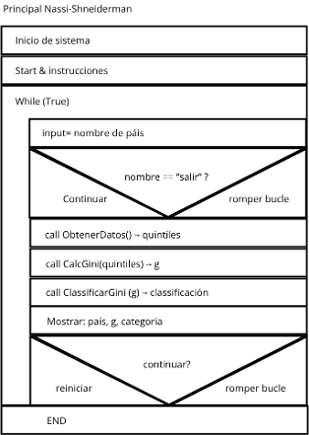
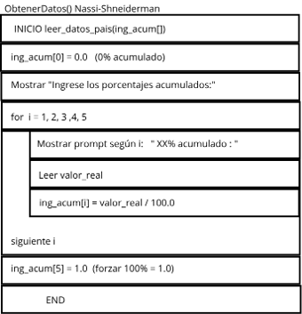
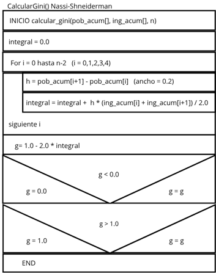
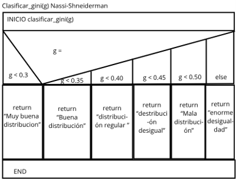

# Proyecto 1 - Índice de Gini

Curso: IC-8052 Lenguajes de Programación  
Tema: Programación Procedimental  

## Descripción

Este programa calcula el coeficiente de Gini de un país a partir de los datos acumulados de distribución del ingreso por quintiles.

El cálculo se realiza utilizando la fórmula:

```txt
g = 1 - 2 * área bajo la curva de Lorenz
```

El área bajo la curva de Lorenz se aproxima mediante la regla del trapecio.

## Lenguaje utilizado

El proyecto fue desarrollado en lenguaje Pascal, siguiendo un enfoque de programación procedimental y estructurada. Se utiliza Free Pascal (FPC) compilado bajo el IDE Lazarus.

## Estructura del proyecto

```txt
Solutions/Pascal/
├── project1.lpr
├── pais_gini.pas
├── entrada_gini.pas
├── calculo_gini.pas
├── clasificacion_gini.pas
├── project1.lpi
├── project1.lps
├── prueba.pas
├── backup/
│   ├── project1.lpi
│   ├── project1.lpr
│   └── project1.lps
├── lib/
│   └── i386-win32/
│       └── project1.compiled
├── README.md
├── Gini_nassi-principal-pascal.png
├── Gini_nassi-datos-pascal.png
├── Gini_nassi-calculo-pascal.png
└── Gini_nassi-clasificacion-pascal.png
```

## Descripción de archivos

- `project1.lpr`: archivo principal del programa, encargado del flujo general.
- `pais_gini.pas`: unidad para leer y validar el nombre del país.
- `entrada_gini.pas`: unidad para leer y validar los porcentajes acumulados del ingreso.
- `calculo_gini.pas`: unidad para el cálculo del coeficiente de Gini.
- `clasificacion_gini.pas`: unidad para clasificar el valor de Gini.
- `project1.lpi`: archivo de configuración del proyecto Lazarus.
- `project1.lps`: archivo de sesión del proyecto Lazarus.
- `prueba.pas`: archivo de pruebas (opcional).

## Procedimientos y Funciones principales

- `LeerNombrePais()`: lee y valida el nombre del país.
- `LeerDatosIngresos()`: lee y valida los porcentajes acumulados del ingreso.
- `CalcularGini()`: calcula el índice de Gini utilizando la regla del trapecio.
- `ClassificarGini()`: clasifica el país según el valor del índice de Gini obtenido.
- `Main()`: controla el flujo principal del programa desde `project1.lpr`.

## Diagramas de flujo

El programa incluye diagramas Nassi-Schneiderman para visualizar el flujo de control:

### Diagrama Principal



### Diagrama de Lectura de Datos



### Diagrama de Cálculo del Coeficiente de Gini



### Diagrama de Clasificación



## Compilación

Para compilar el programa, ejecutar en Lazarus:

1. Abrir el archivo `project1.lpi` en Lazarus.
2. Presionar `Ctrl+F9` o ir a **Run > Build**.
3. El ejecutable se generará como `project1.exe`.

Alternativamente, desde la línea de comandos con Free Pascal:

```bash
fpc project1.lpr
```

## Ejecución

Para ejecutar el programa en Windows PowerShell:

```powershell
.\project1.exe
```

## Datos solicitados al usuario

El programa solicita:

1. Nombre del país.
2. Porcentaje acumulado del ingreso para el 20% de la población.
3. Porcentaje acumulado del ingreso para el 40% de la población.
4. Porcentaje acumulado del ingreso para el 60% de la población.
5. Porcentaje acumulado del ingreso para el 80% de la población.
6. Porcentaje acumulado del ingreso para el 100% de la población.

Los valores deben ingresarse como porcentajes y se acepta el punto decimal. Por ejemplo, para 3.1%, se debe digitar:

```txt
3.1
```

Internamente, el programa convierte ese valor a decimal dividiéndolo entre 100.

El programa permite calcular el coeficiente de Gini para múltiples países en una sola ejecución. Para finalizar, ingrese "salir" cuando se le pida el nombre del país.

## Validaciones de entrada

El programa incorpora validaciones para evitar datos inconsistentes:

1. El nombre del país no puede estar vacío.
2. El nombre del país tiene una longitud máxima de 60 caracteres.
3. El nombre del país solo admite letras y espacios.
4. Cada porcentaje acumulado debe ser numérico.
5. Cada porcentaje debe estar entre 0 y 100.
6. Los porcentajes acumulados deben ser no decrecientes.
7. El último valor debe ser exactamente 100.

Si una entrada no cumple las reglas, el programa muestra un mensaje y vuelve a pedir el dato.

## Ejemplo de prueba

Datos para Estados Unidos:

```txt
Nombre del país: Estados Unidos
20%: 3.1
40%: 11.3
60%: 25.2
80%: 47.8
100%: 100
```

Resultado esperado:

```txt
Coeficiente de Gini: 0.4504
Clasificación: Distribución desigual del ingreso
```

## Clasificación del Índice de Gini

El programa clasifica los países según el índice de Gini calculado:

- **Gini < 0.30**: Muy buena distribución del ingreso
- **0.30 ≤ Gini < 0.35**: Buena distribución del ingreso
- **0.35 ≤ Gini < 0.40**: Distribución regular del ingreso
- **0.40 ≤ Gini < 0.45**: Distribución desigual del ingreso
- **0.45 ≤ Gini < 0.50**: Mala distribución del ingreso
- **Gini ≥ 0.50**: Enorme desigualdad del ingreso
